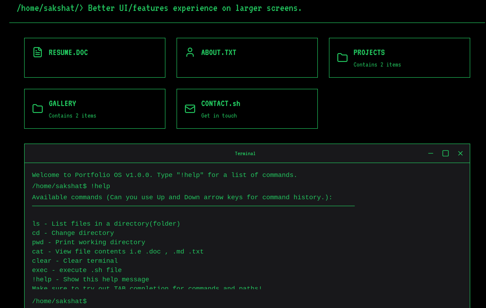

# Retro Terminal Portfolio

A  portfolio website designed with a retro terminal aesthetic, built using Next.js and styled with Tailwind CSS. The site features a fully functional (heavily exaggerated) terminal interface.



## ✨ Features

- **Interactive Terminal**: Fully functional command-line interface with common Unix commands
  - `ls`: List directory contents
  - `cd`: Change directory
  - `cat`: View file contents
  - `pwd`: Print working directory
  - `clear`: Clear terminal
  - `!help`: Display available commands
  - Can you Up and Down Arrow keys to mimic terminal history.
  - TAB Completions. 


## 🚀 Technologies Used

- Next.js 14
- Tailwind CSS
- Lucide Icons
- Custom SVG implementations

## 💻 Local Development

1. Clone the repository:
```bash
git clone git@github.com:asakshat/portfolio_os.git
cd portfolio
```

2. Install dependencies:
```bash
npm install
# or
yarn install
```


4. Run the development server:
```bash
npm run dev
# or
yarn dev
```

5. Open [http://localhost:3000](http://localhost:3000) in your browser.

## 📁 Project Structure

```
portfolio/
├── public/          # Static assets
├── src/
│   ├── app/         # Next.js app directory
│   ├── components/  # React components
│   ├── constants/   # Configuration files
│   ├── hooks/       # Custom React hooks
│   └── utils/       # Utility functions
```

## 🎨 Customization


### Adding Commands
New terminal commands can be added in `src/utils/commands.js`

### File System
The virtual file system can be modified in `src/constants/fileSystemData.js`

## 📝 License

This project is licensed under the MIT License - see the [LICENSE.md](LICENSE.md) file for details.

## 🤝 Contributing

Contributions, issues, and feature requests are welcome! Feel free to check the [issues page](https://github.com/yourusername/portfolio/issues).

## 👤 Author

**Sakshat Adhikari**
- GitHub: [@asakshat](https://github.com/asakshat)
- LinkedIn: [Sakshat Adhikari](https://www.linkedin.com/in/sakshat-adhikari-8a6a10222/)